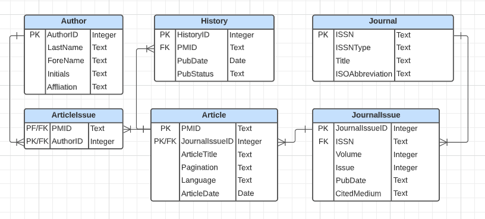
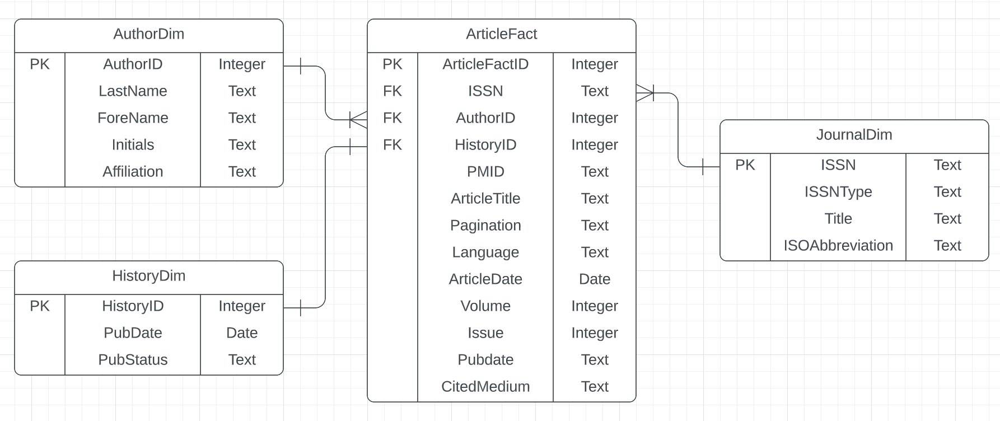
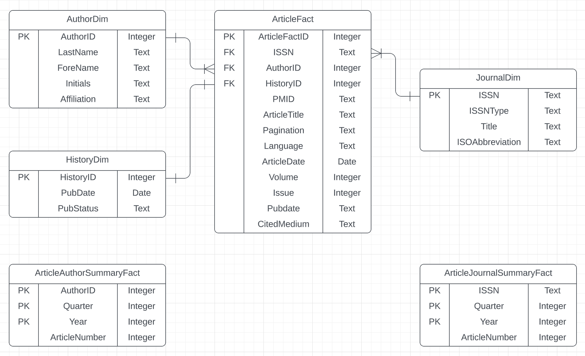

# Part 1
## Q1
### ERD of normalized relational schema


## Q2

### Setup Database and XML file
```{r}
library(XML)
library(RSQLite)
library(dplyr)

fpath <- "./"
dbfile <- "practicum2_group3.db"
xmlfile <- "pubmed_sample.xml"

# if database file already exists, we connect to it, otherwise
# we create a new database
dbcon <- dbConnect(RSQLite::SQLite(), paste0(fpath,dbfile))
#dbExecute(dbcon, "PRAGMA foreign_keys = ON")
dbListTables(dbcon)
```

### Clean up table 


```{sql connection = "dbcon"}
DROP TABLE IF EXISTS Journal;
```

```{sql connection = "dbcon"}
DROP TABLE IF EXISTS Author;
```

```{sql connection = "dbcon"}
DROP TABLE IF EXISTS JournalIssue;
```

```{sql connection = "dbcon"}
DROP TABLE IF EXISTS Article;
```

```{sql connection = "dbcon"}
DROP TABLE IF EXISTS History;
```

```{sql connection = "dbcon"}
DROP TABLE IF EXISTS ArticleIssue;
```

### Create Tables

```{sql connection ="dbcon"}
CREATE TABLE `Journal` (
  `ISSN`            TEXT NOT NULL PRIMARY KEY,
  `ISSNType`        TEXT NOT NULL,
  `Title`           TEXT NOT NULL,
  `ISOAbbreviation` TEXT NOT NULL
);
```

```{sql connection = "dbcon"}
CREATE TABLE `Author` (
  `AuthorID`         INTEGER NOT NULL PRIMARY KEY AUTOINCREMENT,
  `LastName`         TEXT NOT NULL,
  `ForeName`         TEXT NOT NULL,
  `Initials`         TEXT NOT NULL,
  `Affiliation`      TEXT NOT NULL
);

```

```{sql connection = "dbcon"}
CREATE TABLE `JournalIssue` (
  `JournalIssueID` INTEGER NOT NULL PRIMARY KEY AUTOINCREMENT,
  `ISSN`           TEXT NOT NULL,
  `Volume`         INTEGER NOT NULL,
  `Issue`          INTEGER NOT NULL,
  `PubDate`        TEXT NOT NULL,
  `CitedMedium`    TEXT NOT NULL,
  CONSTRAINT JournalIssue_FK FOREIGN KEY (ISSN)         
  REFERENCES Journal (ISSN)      
  ON DELETE CASCADE
);
```

```{sql connection ="dbcon"}
CREATE TABLE `Article` (
  `PMID`           TEXT NOT NULL PRIMARY KEY,
  `JournalIssueID` INTEGER NOT NULL,
  `ArticleTitle`   TEXT NOT NULL,
  `Pagination`     TEXT NOT NULL,
  `Language`       TEXT NOT NULL,
  `ArticleDate`    DATE NOT NULL,
  CONSTRAINT Article_FK FOREIGN KEY (JournalIssueID)     
  REFERENCES JournalIssue (JournalIssueID)             
  ON DELETE CASCADE
);
```

```{sql connection = "dbcon"}
CREATE TABLE `History` (
  `HistoryID` INTEGER NOT NULL PRIMARY KEY AUTOINCREMENT,
  `PMID`      TEXT NOT NULL,
  `PubStatus` TEXT NOT NULL,
  `PubDate`   DATE NOT NULL,
  CONSTRAINT History_FK FOREIGN KEY (PMID)               
  REFERENCES Article (PMID)      
  ON DELETE CASCADE
);
```

```{sql connection = "dbcon"}
CREATE TABLE `ArticleIssue` (
  `PMID`     TEXT NOT NULL,
  `AuthorId` INTEGER NOT NULL,
  CONSTRAINT ArticleIssue_FK0   FOREIGN KEY (PMID)          
  REFERENCES Article (PMID)      
  ON DELETE CASCADE,
  CONSTRAINT ArticleIssue_FK1   FOREIGN KEY (AuthorID)      
  REFERENCES Author (AuthorID)   
  ON DELETE CASCADE
);
```

## Q3
### Parse XML File
```{r}
fpn = paste0(fpath, xmlfile)
xmlDOM <- xmlParse(file = fpn)
xmlRoot <- xmlRoot(xmlDOM)
#head(xmlRoot)
```

### Create Data Frame For Each Table
```{r}
Journal.df <- data.frame(ISSN = character(),
                         ISSNType = character(),
                         Title = character(),
                         ISOAbbreviation = character(),
                         stringsAsFactors = FALSE)

Author.df <- data.frame(AuthorID = integer(),
                        LastName = character(),
                        ForeName = character(),
                        Initials = character(),
                        Affiliation = character(),
                        stringsAsFactors = FALSE)

JournalIssue.df <- data.frame(JournalIssueID = integer(),
                              ISSN = character(),
                              CitedMedium = character(),
                              Volume = integer(),
                              Issue = integer(),
                              PubDate = character(),
                              stringsAsFactors = FALSE)

Article.df <- data.frame(PMID = character(),
                         JournalIssueID = integer(),
                         ArticleTitle = character(),
                         Pagination = character(),
                         Language = character(),
                         ArticleDate = character(),
                         stringsAsFactors = FALSE)

History.df <- data.frame(HistoryID = integer(),
                         PMID = character(),
                         PubStatus = character(),
                         PubDate = character(),
                         stringsAsFactors = FALSE)

ArticleIssue.df <- data.frame(PMID = character(),
                              AuthorID = integer(),
                              stringsAsFactors = FALSE)

```

### Create Praser For Each Table
Parser of Journal DF
```{r}
parseJournal <- function(journals)
{
  rows.df <- data.frame (ISSN = character(),
                         ISSNType = character(),
                         Title = character(),
                         ISOAbbreviation = character(),
                         stringsAsFactors = FALSE)

  # Use actual row index since we skip some record if duplicated
  rowIdx = 1

  for (i in 1: xmlSize(journals))
  {
    dataNode <- journals[[i]]
    issn <- xpathSApply(dataNode, "ISSN", xmlValue)
    issnType <- xpathSApply(dataNode, "ISSN", xmlAttrs)
    title <- xpathSApply(dataNode, "Title", xmlValue)
    isoAbbreviation <- xpathSApply(dataNode, "ISOAbbreviation", xmlValue)

    if(!any(Journal.df$ISSN == issn)) {
      rows.df[rowIdx,1] <- issn
      rows.df[rowIdx,2] <- issnType
      rows.df[rowIdx,3] <- title
      rows.df[rowIdx,4] <- isoAbbreviation
      rowIdx <- rowIdx + 1
    }
  }

  return(rows.df)
}
```

Parser of Author DF
```{r}
parseAuthor <- function(authors) {
  rows.df <- data.frame(AuthorID = integer(),
                        LastName = character(),
                        ForeName = character(),
                        Initials = character(),
                        Affiliation = character(),
                        stringsAsFactors = FALSE)

  # Initialize authorIdx using Author.df record count
  authorIdx <- nrow(Author.df) + 1
  rowIdx <- 1

  for (i in 1: xmlSize(authors)) {
    dataNode <- authors[[i]]
    lastName <- xpathSApply(dataNode, "LastName", xmlValue)
    foreName <- xpathSApply(dataNode, "ForeName", xmlValue)
    initials <- xpathSApply(dataNode, "Initials", xmlValue)
    affiliation <- xpathSApply(dataNode, "Affiliation", xmlValue)

    # Process Empty Affiliation
    if (length(affiliation) == 0) affiliation <- ""

    # Check if author already exists
    existingAuthor <-  which(Author.df$LastName == lastName &
                                Author.df$ForeName == foreName &
                                Author.df$Initials == initials)
    if(!any(existingAuthor)) {
      author <- data.frame(AuthorID = authorIdx,
                           LastName = lastName,
                           ForeName = foreName,
                           Initials = initials,
                           Affiliation = affiliation)
      rows.df[rowIdx,1] <- authorIdx
      rows.df[rowIdx,2] <- lastName
      rows.df[rowIdx,3] <- foreName
      rows.df[rowIdx,4] <- initials
      rows.df[rowIdx,5] <- affiliation

      # Increment authorIdx and rowIdx
      rowIdx <- rowIdx + 1
      authorIdx <- authorIdx + 1
    }
  }

  return(rows.df)
}


```

Parser of JournalIssue DF
```{r}
parseJournalIssue <- function(journals)
{
  rows.df <- data.frame (JournalIssueID = integer(),
                              ISSN = character(),
                              CitedMedium = character(),
                              Volume = integer(),
                              Issue = integer(),
                              PubDate = character(),
                              stringsAsFactors = FALSE)

  # Use Journal Issue DF record count as Auto Increment
  journalIdx <- nrow(JournalIssue.df) + 10000000

  for (i in 1: xmlSize(journals))
  {
    dataNode <- journals[[i]]
    issn <- xpathSApply(dataNode, "ISSN", xmlValue)
    citedMedium <- xpathSApply(dataNode, "JournalIssue", xmlAttrs)
    volume <- xpathSApply(dataNode, "JournalIssue/Volume", xmlValue)
    issue <- xpathSApply(dataNode, "JournalIssue/Issue", xmlValue)
    pubDate <- xpathSApply(dataNode, "JournalIssue/PubDate", xmlValue)

    journalIdx <- journalIdx + 1
    rows.df[i,1] <- journalIdx
    rows.df[i,2] <- issn
    rows.df[i,3] <- citedMedium
    rows.df[i,4] <- volume
    rows.df[i,5] <- issue
    rows.df[i,6] <- pubDate
  }

  return(rows.df)
}
```

Parser of Article DF
```{r}
parseArticle <- function(pmid, article) {
  rows.df <- data.frame(PMID = character(),
                         JournalIssueID = integer(),
                         ArticleTitle = character(),
                         Pagination = character(),
                         Language = character(),
                         ArticleDate = character(),
                         stringsAsFactors = FALSE)
 for (i in 1: xmlSize(article))
  {
      dataNode <- article[[i]]
      articleTitle = xpathSApply(dataNode, "ArticleTitle", xmlValue)
      pagination = xpathSApply(dataNode, "Pagination/MedlinePgn", xmlValue)
      language = xpathSApply(dataNode, "Language", xmlValue)
      issn = xpathSApply(dataNode, "Journal/ISSN", xmlValue)
      volume = xpathSApply(dataNode, "Journal/JournalIssue/Volume", xmlValue)
      issue = xpathSApply(dataNode, "Journal/JournalIssue/Issue", xmlValue)
      yy = xpathSApply(dataNode, "ArticleDate/Year", xmlValue)
      mm = xpathSApply(dataNode, "ArticleDate/Month", xmlValue)
      dd = xpathSApply(dataNode, "ArticleDate/Day", xmlValue)

      # Derived Field
      articleDate <- paste(yy, mm, dd, sep="-")
      if (length(articleDate) == 0) articleDate <- '1970-01-01'

      # Lookup Journal Issue ID
      index <- which(JournalIssue.df$ISSN == issn & JournalIssue.df$Volume == volume & JournalIssue.df$Issue == issue )
      journalIssueID = JournalIssue.df[index, "JournalIssueID"]
      
      rows.df[i,1] <- pmid
      rows.df[i,2] <- journalIssueID
      rows.df[i,3] <- articleTitle
      rows.df[i,4] <- pagination
      rows.df[i,5] <- language
      rows.df[i,6] <- articleDate
    }

    return(rows.df)

}


```
Parser of History DF
```{r}
parseHistory <- function(pmid, history)
{
  rows.df <-data.frame(HistoryID = integer(),
                         PMID = character(),
                         PubStatus = character(),
                         PubDate = character(),
                         stringsAsFactors = FALSE)

  # Use History DF record count as Auto Increment
  historyIdx <- nrow(History.df) + 10000000

  for (i in 1: xmlSize(history))
  {
    dataNode <- history[[i]]
    yy <- xpathSApply(dataNode, "Year", xmlValue)
    mm <- xpathSApply(dataNode, "Month", xmlValue)
    dd <- xpathSApply(dataNode, "Day", xmlValue)

    # Derived Field
    pubDate <- as.character(as.Date(paste(yy, mm, dd, sep="-"), format = "%Y-%m-%d"))

    # Create the "ID"
    historyIdx <- historyIdx + 1

    rows.df[i,1] <- historyIdx
    rows.df[i,2] <- pmid
    rows.df[i,3] <- xmlAttrs(dataNode, 2)
    rows.df[i,4] <- pubDate

  }

  return(rows.df)
}
```
Parser of ArticleIssue DF
```{r}
parseArticleIssue <- function(pmid, authors) {
  rows.df <- data.frame(PMID = character(0),
                        AuthorID = integer(0),
                        stringsAsFactors = FALSE)
  
  for (i in 1:xmlSize(authors)) {
    dataNode <- authors[[i]]
    lastName <- xpathSApply(dataNode, "LastName", xmlValue)
    foreName <- xpathSApply(dataNode, "ForeName", xmlValue)
    initials <- xpathSApply(dataNode, "Initials", xmlValue)
    
    # Find authorID from Author.df
    authorID <- Author.df[Author.df$LastName == lastName &
                          Author.df$ForeName == foreName &
                          Author.df$Initials == initials, "AuthorID"]
    
    newRow <- data.frame(PMID = pmid, AuthorID = authorID)
    rows.df <- rbind(rows.df, newRow)
  }
  
  return(rows.df)
}


```

### Extract Info from XML and parse to DF
Iterates through the XML document node by node, extracting relevant information and parsing it into the appropriate data frames.
```{r}
size <- xmlSize(xmlRoot)
for (i in 1 : size){
  node = xmlRoot[[i]]
  pmid = xmlValue(xpathSApply(node[[1]], "PMID"))

  # Process Journal
  journals = xpathApply(node[[1]], "Article/Journal")
  journalRows <- parseJournal(journals)
  if (nrow(journalRows) > 0){
    Journal.df <- rbind(Journal.df, journalRows)
  }

  # Process Journal Issue
  journalIssueRows <- parseJournalIssue(journals)
  if (nrow(journalIssueRows) > 0){
    JournalIssue.df <- rbind(JournalIssue.df, journalIssueRows)
  }

  # Process History
  history = xpathApply(node[[2]], "History/PubMedPubDate")
  historyRows <- parseHistory(pmid, history)
  if (nrow(historyRows) > 0){
    History.df <- rbind(History.df, historyRows)
  }

  # Process Author (Record will be skipped if it was added previously)
  authors = xpathApply(node[[1]], "Article/AuthorList/Author")
  authorRows <- parseAuthor(authors)
  if (nrow(authorRows) > 0){
    Author.df <- rbind(Author.df, authorRows)
  }

  # Process Article Issue
  articleIssueRows <- parseArticleIssue(pmid, authors)
  if (nrow(articleIssueRows) > 0){
    ArticleIssue.df <- rbind(ArticleIssue.df, articleIssueRows)
  }

  # Process Article
  article = xpathApply(node[[1]], "Article")
  articleRows <- parseArticle(pmid, article)
  if (nrow(articleRows) > 0){
    Article.df <- rbind(Article.df, articleRows)
  }
}


```


```{r}
History.df
Author.df
ArticleIssue.df
Article.df
Journal.df
JournalIssue.df
```
### Write Result into database
```{r}
dbWriteTable(dbcon, "Article", Article.df, overwrite = TRUE)
dbWriteTable(dbcon, "ArticleIssue", ArticleIssue.df, overwrite = TRUE)
dbWriteTable(dbcon, "Author", Author.df, overwrite = TRUE)
dbWriteTable(dbcon, "History", History.df, overwrite = TRUE)
dbWriteTable(dbcon, "Journal", Journal.df, overwrite = TRUE)
dbWriteTable(dbcon, "JournalIssue", JournalIssue.df, overwrite = TRUE)

```

```{sql connection = "dbcon"}
SELECT * FROM Article;
```

```{sql connection = "dbcon"}
SELECT * FROM ArticleIssue;
```

```{sql connection = "dbcon"}
SELECT * FROM Author;
```

```{sql connection = "dbcon"}
SELECT * FROM History;
```

```{sql connection = "dbcon"}
SELECT * FROM Journal;
```

```{sql connection = "dbcon"}
SELECT * FROM JournalIssue;
```

# Part 2

## Q1

Create and populate a star schema with dimension and transaction fact tables. 
Each row in the fact table will represent one article fact. 
Include the image of an updated ERD that contains the fact table and any additional required dimension tables. 
Populate the star schema in R. 
When building the schema, look a head to Part 3 as the schema is dependent on the eventual OLAP queries.

### Link to Lucid chart

[link](https://lucid.app/lucidchart/a37b3bf2-7583-41c1-8514-db994b7df6c9/edit?viewport_loc=-264%2C-121%2C2128%2C1028%2C0_0&invitationId=inv_f3a7a20d-4003-4b2b-bf53-82aabb7e2787)

### ERD of star schema



### Populate the star schema

#### Clean up

```{sql connection = "dbcon"}
DROP TABLE IF EXISTS ArticleFact;
```
```{sql connection = "dbcon"}
DROP TABLE IF EXISTS AuthorDim;
```
```{sql connection = "dbcon"}
DROP TABLE IF EXISTS HistoryDim;
```
```{sql connection = "dbcon"}
DROP TABLE IF EXISTS JournalDim;
```

#### Create and populate tables

The following relationships are extracted from the normalized tables:
- 1 article belongs to 1 journal issue. 1 journal issue has multiple articles. This means JournalID:PMID = many:1
- 1 aticle has multiple authors and histories. This means PMID:AuthorID = 1: many, and PMID:HistoryID =1:many

Now the fact table is built around Article. This means that 1 article is a combination of journal info, authorID, and historyID.

There are two ways to create the article fact table:
- Use a complex key.
- Use an artificial primary key -> chosen for this project.

1. Author dimension

```{sql connection ="dbcon"}
CREATE TABLE AuthorDim (
  AuthorID    INTEGER NOT NULL PRIMARY KEY,
  LastName    TEXT NOT NULL,
  ForeName    TEXT NOT NULL,
  Initials    TEXT NOT NULL,
  Affiliation TEXT NOT NULL
);
```
```{sql connection ="dbcon"}
INSERT INTO AuthorDim
  SELECT AuthorID,
         LastName,
         ForeName,
         Initials,
         Affiliation 
    FROM Author;
```

2. History dimension

```{sql connection ="dbcon"}
CREATE TABLE HistoryDim (
  HistoryID   INTEGER NOT NULL PRIMARY KEY,
  PubDate    DATE NOT NULL,
  PubStatus TEXT NOT NULL
);
```
```{sql connection ="dbcon"}
INSERT INTO HistoryDim
  SELECT HistoryID,
         PubDate,
         PubStatus
    FROM History;
```

3. Journal dimension

```{sql connection ="dbcon"}
CREATE TABLE JournalDim (
  ISSN            TEXT NOT NULL PRIMARY KEY,
  ISSNType        TEXT NOT NULL,
  Title           TEXT NOT NULL,
  ISOAbbreviation TEXT NOT NULL
);
```
```{sql connection ="dbcon"}
INSERT INTO JournalDim
  SELECT ISSN,
         ISSNType,
         Title,
         ISOAbbreviation
    FROM Journal;
```

4. Article fact

PMID attribute is kept to identify unique articles in Part 3.

```{sql connection ="dbcon"}
CREATE TABLE ArticleFact (
  ArticleFactID INTEGER PRIMARY KEY AUTOINCREMENT,
  ISSN          TEXT NOT NULL,
  AuthorID      INTEGER NOT NULL,
  HistoryID     INTEGER NOT NULL,
  PMID          TEXT NOT NULL,
  ArticleTitle  TEXT NOT NULL,
  Pagination    TEXT NOT NULL,
  Language      TEXT NOT NULL,
  ArticleDate   Date NOT NULL,
  Volume        INTEGER NOT NULL,
  Issue         INTEGER NOT NULL,
  PubDate       TEXT NOT NULL,
  CitedMedium   TEXT NOT NULL,
  CONSTRAINT FK_Article_Journal FOREIGN KEY (ISSN)      REFERENCES JournalDim (ISSN)      ON DELETE CASCADE,
  CONSTRAINT FK_Article_Author  FOREIGN KEY (AuthorID)  REFERENCES AuthorDim (AuthorID)   ON DELETE CASCADE,
  CONSTRAINT FK_Article_History FOREIGN KEY (HistoryID) REFERENCES HistoryDim (HistoryID) ON DELETE CASCADE
);
```
```{sql connection ="dbcon"}
INSERT INTO ArticleFact (
  ISSN, 
  AuthorID, 
  HistoryID, 
  PMID,
  ArticleTitle, 
  Pagination, 
  Language, 
  ArticleDate,
  Volume,
  Issue,
  PubDate,
  CitedMedium
)
  SELECT JI.ISSN        AS ISSN,
         AI.AuthorID    AS AuthorID,
         H.HistoryID    AS HistoryID,
         A.PMID         AS PMID,
         A.ArticleTitle AS ArticleTitle,
         A.Pagination   AS Pagination,
         A.Language     AS Language,
         A.ArticleDate  AS ArticleDate,
         JI.Volume      AS Volume,
         JI.Issue       AS Issue,
         JI.PubDate     AS PubDate,
         JI.CitedMedium AS CitedMedium
    FROM Article A
    JOIN JournalIssue JI on JI.JournalIssueID = A.JournalIssueID
    JOIN Journal J on J.ISSN = JI.ISSN
    JOIN History H on H.PMID = A.PMID
    JOIN ArticleIssue AI on AI.PMID = A.PMID
    JOIN Author AU on AU.AuthorID = AI.AuthorID;
```

#### Display table

```{sql connection ="dbcon"}
SELECT * FROM AuthorDim;
```
```{sql connection ="dbcon"}
SELECT * FROM HistoryDim;
```
```{sql connection ="dbcon"}
SELECT * FROM JournalDim;
```
```{sql connection ="dbcon"}
SELECT * FROM ArticleFact;
```

## Q2

In the same schema as the previous step, create and populate a summary fact table that represents number of articles per time period (quarter, year) by author and by journal. 
Include the image of an updated ERD that contains the fact table. 
Populate the fact table in R. When building the schema, look a head to Part 3 as the schema is dependent on the eventual OLAP queries.



### Clean up

```{sql connection = "dbcon"}
DROP TABLE IF EXISTS ArticleAuthorSummaryFact;
```
```{sql connection = "dbcon"}
DROP TABLE IF EXISTS ArticleJournalSummaryFact;
```

### Populate the fact table

1. Number of articles per time period (quarter, year) by author

```{sql connection ="dbcon"}
CREATE TABLE ArticleAuthorSummaryFact (
  AuthorID      INTEGER NOT NULL,
  Quarter       INTEGER NOT NULL,
  Year          INTEGER NOT NULL,
  ArticleNumber INTEGER NOT NULL,
  PRIMARY KEY (AuthorID, Quarter, Year)
);
```
```{sql connection ="dbcon"}
INSERT INTO ArticleAuthorSummaryFact
  SELECT AF.AuthorID AS AuthorID,
         (2 + strftime('%m', HD.PubDate)) / 3 AS Quarter,
         strftime('%Y', HD.PubDate) AS Year,
         COUNT(DISTINCT ArticleFactID) AS ArticleNumber
    FROM ArticleFact AF
    JOIN AuthorDim AD ON AD.AuthorID = AF.AuthorID
    JOIN HistoryDim HD ON HD.HistoryID = AF.HistoryID
   WHERE HD.PubStatus = 'accepted'
   GROUP BY AF.AuthorID, Year, Quarter;
```

2. Number of articles per time period (quarter, year) by journal

```{sql connection ="dbcon"}
CREATE TABLE ArticleJournalSummaryFact (
  ISSN          INTEGER NOT NULL,
  Quarter       INTEGER NOT NULL,
  Year          INTEGER NOT NULL,
  ArticleNumber INTEGER NOT NULL,
  PRIMARY KEY (ISSN, Quarter, Year)
);
```
```{sql connection ="dbcon"}
INSERT INTO ArticleJournalSummaryFact
  SELECT AF.ISSN AS ISSN,
         (2 + strftime('%m', HD.PubDate)) / 3 AS Quarter,
         strftime('%Y', HD.PubDate) AS Year,
         COUNT(DISTINCT ArticleFactID) AS ArticleNumber
    FROM ArticleFact AF
    JOIN JournalDim JD ON JD.ISSN = AF.ISSN
    JOIN HistoryDim HD ON HD.HistoryID = AF.HistoryID
   WHERE HD.PubStatus = 'accepted'
   GROUP BY AF.ISSN, Year, Quarter;
```
```{sql connection= dbcon}
SELECT * FROM ArticleJournalSummaryFact

```

### Display results

1. Count number of articles per year by author

```{sql connection ="dbcon"}
SELECT AASF.AuthorID,
       AD.LastName,
       AD.ForeName,
       AASF.Year,
       SUM(AASF.ArticleNumber) AS ArticlesPerYear
  FROM ArticleAuthorSummaryFact AASF
  JOIN AuthorDim AD ON AASF.AuthorID = AD.AuthorID
 GROUP BY AASF.AuthorID, Year;
```

2. Count number of articles per year by journal

```{sql connection ="dbcon"}
SELECT AJSF.ISSN,
       JD.Title,
       AJSF.Year,
       SUM(AJSF.ArticleNumber) AS ArticlesPerYear
  FROM ArticleJournalSummaryFact AJSF
  JOIN JournalDim JD ON AJSF.ISSN = JD.ISSN
 GROUP BY AJSF.ISSN, Year;
```

# Part 3: Explore and Mine Data


## Number of publications for all journals each quarter

```{sql connection ="dbcon"}
SELECT Year AS Year, 
       Quarter, 
       SUM(ArticleNumber) AS num_of_articles
  FROM ArticleJournalSummaryFact
  GROUP BY Year, Quarter;
```
```{r}
# Import required libraries
library(ggplot2)
library(RSQLite)
```
### Line charts to show trends of publications 

1. Line graph for number of publications for all journals each quarter
```{r}
# query
data <- dbGetQuery(dbcon, "SELECT Year, Quarter, SUM(ArticleNumber) as TotalArticles FROM ArticleJournalSummaryFact GROUP BY Year, Quarter")

# create line chart
ggplot(data, aes(x = paste(Year, "Q", Quarter), y = TotalArticles, group = 1)) +
  geom_line(color = "blue") +
  labs(title = "Total Number of Publications by Quarter", x = "Quarter", y = "Total Publications") +
  theme_minimal()
```

2.Combo chart showing number of publications for all journals each quarter
```{r}
# Query
query <- "SELECT Quarter, Year, SUM(ArticleNumber) AS TotalArticles 
          FROM ArticleJournalSummaryFact 
          GROUP BY Quarter, Year"
df <- dbGetQuery(dbcon, query)


# Convert Quarter and Year to Date format
df$Date <- paste0(df$Year, "-", (df$Quarter - 1) * 3 + 1, "-01")
df$Date <- lubridate::ymd(df$Date)

# Combine the line and bar charts
combo_plot <- ggplot() +
  geom_bar(data = df, aes(x = Date, y = TotalArticles), stat = "identity", fill = "lightblue") +
  geom_line(data = df, aes(x = Date, y = TotalArticles), color = "blue") +
  scale_x_date(date_labels = "%b %Y", date_breaks = "3 months") +
  labs(x = "Quarter", y = "Total Publications",
       title = "Total Publications by Quarter") +
  theme_minimal()

# Show the combo chart
combo_plot

```

3. Stacked bar chart showing Total Publications by Quarter and Journal
```{r}
#query
publications_by_quarter <- dbGetQuery(dbcon, "
  SELECT ISSN, Year, Quarter, SUM(ArticleNumber) AS TotalPublications
  FROM ArticleJournalSummaryFact
  GROUP BY ISSN, Year, Quarter
")
# create the bar chart
ggplot(publications_by_quarter, aes(x = Quarter, y = TotalPublications)) +
  geom_bar(stat = "identity", aes(fill = ISSN)) +
  labs(title = "Total Publications by Quarter and Journal",
       x = "Quarter",
       y = "Total Publications",
       fill = "ISSN",
       color = "ISSN") +
  theme_bw()


```

4. Bar graph showing Total Publications by Journal over Time
```{r}


# query
data <- dbGetQuery(dbcon, "SELECT ISSN, Year, Quarter, SUM(ArticleNumber) AS TotalPublications
  FROM ArticleJournalSummaryFact
  GROUP BY ISSN, Year, Quarter")

# Plot the graph
ggplot(publications_by_quarter, aes(x = Quarter, y = TotalPublications)) +
  geom_bar(stat = "identity", aes(fill = ISSN)) +
  facet_wrap(~Year, ncol = 3) +
  labs(title = "Total Publications by Journal in 2011 and 2012",
       x = "Quarter",
       y = "Total Publications",
       fill = "ISSN",
       color = "ISSN") +
  theme_bw()


```


## Average number of days between submission and publication

Extract submission and publication dates for one particular article

```{sql connection ="dbcon"}
DROP VIEW ArticleSubPubDates_SameColumn;
```
```{sql connection ="dbcon"}
CREATE VIEW ArticleSubPubDates_SameColumn
AS 
SELECT AF.PMID,
       HD.PubStatus,
       HD.PubDate
  FROM ArticleFact AF
  JOIN HistoryDim HD ON HD.HistoryID = AF.HistoryID
 WHERE HD.PubStatus IN ("accepted", "received")
 GROUP BY AF.ArticleTitle, HD.PubStatus
```
```{sql connection ="dbcon"}
SELECT * FROM ArticleSubPubDates_SameColumn;
```

Separate information into 2 columns

```{sql connection ="dbcon"}
DROP VIEW ArticleSubPubDates;
```
```{sql connection ="dbcon"}
CREATE VIEW ArticleSubPubDates
AS
SELECT A1.PMID,
       A1.PubDate AS ReceivedDate,
       A2.PubDate AS AcceptedDate
  FROM ArticleSubPubDates_SameColumn A1
  JOIN ArticleSubPubDates_SameColumn A2 ON A1.PMID = A2.PMID AND A1.PubStatus <> A2.PubStatus
 WHERE A1.PubStatus <> "accepted"
```
```{sql connection ="dbcon"}
SELECT * FROM ArticleSubPubDates;
```


Calculate number of days in between

```{sql connection ="dbcon"}
SELECT AVG(JULIANDAY(AcceptedDate) - JULIANDAY(ReceivedDate))
  FROM ArticleSubPubDates;
```

### Graphs to show trends of publications based on submission and publication dates

1. Histogram showing the review time

```{r}
# Query data from the database
data <- dbGetQuery(dbcon, "SELECT JULIANDAY(AcceptedDate) - JULIANDAY(ReceivedDate) AS review_time
                           FROM ArticleSubPubDates")

# Create histogram of review time
ggplot(data, aes(x = review_time)) +
  geom_histogram(binwidth = 10, color = "white", fill = "blue") +
  labs(title = "Publications' Review Time",
       x = "Days from Submission to Acceptance",
       y = "Number of Articles") 

```

2. Line graph to show number of articles submission and publication over time
```{r}
# Query data from the database
data <- dbGetQuery(dbcon, "SELECT strftime('%Y-%m', PubDate) AS month,
                                 COUNT(DISTINCT CASE WHEN PubStatus = 'received' THEN PMID END) AS num_submitted,
                                 COUNT(DISTINCT CASE WHEN PubStatus = 'accepted' THEN PMID END) AS num_accepted
                          FROM ArticleSubPubDates_SameColumn
                          GROUP BY month")

# Convert month to date format
data$month <- as.Date(paste0(data$month, "-01"))

# Create time series plot
ggplot(data, aes(x = month)) +
  geom_line(aes(y = num_submitted, color = "Submitted")) +
  geom_line(aes(y = num_accepted, color = "Published")) +
  scale_color_manual(name = "Legend", values = c("Submitted" = "red", "Published" = "blue")) +
  labs(title = "Number of Articles Submitted and Published over Time",
       x = "Time Period",
       y = "Number of Articles")
```


### Close the connection
```{r}
dbDisconnect(dbcon)
```
