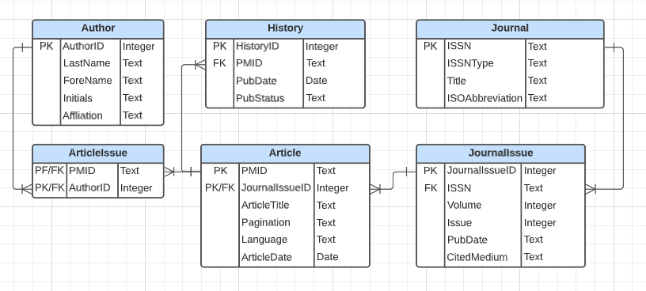

# Part 1
## Q1
### ERD of normalized relational schema


## Q2

### Setup Database and XML file
```{r}
library(XML)
library(RSQLite)
library(dplyr)

fpath <- "./"
dbfile <- "practicum2_group3.db"
xmlfile <- "pubmed_sample.xml"

# if database file already exists, we connect to it, otherwise
# we create a new database
dbcon <- dbConnect(RSQLite::SQLite(), paste0(fpath,dbfile))
#dbExecute(dbcon, "PRAGMA foreign_keys = ON")
dbListTables(dbcon)
```

### Clean up table 


```{sql connection = "dbcon"}
DROP TABLE IF EXISTS Journal;
```

```{sql connection = "dbcon"}
DROP TABLE IF EXISTS Author;
```

```{sql connection = "dbcon"}
DROP TABLE IF EXISTS JournalIssue;
```

```{sql connection = "dbcon"}
DROP TABLE IF EXISTS Article;
```

```{sql connection = "dbcon"}
DROP TABLE IF EXISTS History;
```

```{sql connection = "dbcon"}
DROP TABLE IF EXISTS ArticleIssue;
```

### Create Tables

```{sql connection ="dbcon"}
CREATE TABLE `Journal` (
  `ISSN`            TEXT NOT NULL PRIMARY KEY,
  `ISSNType`        TEXT NOT NULL,
  `Title`           TEXT NOT NULL,
  `ISOAbbreviation` TEXT NOT NULL
);
```

```{sql connection = "dbcon"}
CREATE TABLE `Author` (
  `AuthorID`         INTEGER NOT NULL PRIMARY KEY AUTOINCREMENT,
  `LastName`         TEXT NOT NULL,
  `ForeName`         TEXT NOT NULL,
  `Initials`         TEXT NOT NULL,
  `Affiliation`      TEXT NOT NULL
);

```

```{sql connection = "dbcon"}
CREATE TABLE `JournalIssue` (
  `JournalIssueID` INTEGER NOT NULL PRIMARY KEY AUTOINCREMENT,
  `ISSN`           TEXT NOT NULL,
  `Volume`         INTEGER NOT NULL,
  `Issue`          INTEGER NOT NULL,
  `PubDate`        TEXT NOT NULL,
  `CitedMedium`    TEXT NOT NULL,
  CONSTRAINT JournalIssue_FK FOREIGN KEY (ISSN)         
  REFERENCES Journal (ISSN)      
  ON DELETE CASCADE
);
```

```{sql connection ="dbcon"}
CREATE TABLE `Article` (
  `PMID`           TEXT NOT NULL PRIMARY KEY,
  `JournalIssueID` INTEGER NOT NULL,
  `ArticleTitle`   TEXT NOT NULL,
  `Pagination`     TEXT NOT NULL,
  `Language`       TEXT NOT NULL,
  `ArticleDate`    DATE NOT NULL,
  CONSTRAINT Article_FK FOREIGN KEY (JournalIssueID)     
  REFERENCES JournalIssue (JournalIssueID)             
  ON DELETE CASCADE
);
```

```{sql connection = "dbcon"}
CREATE TABLE `History` (
  `HistoryID` INTEGER NOT NULL PRIMARY KEY AUTOINCREMENT,
  `PMID`      TEXT NOT NULL,
  `PubStatus` TEXT NOT NULL,
  `PubDate`   DATE NOT NULL,
  CONSTRAINT History_FK FOREIGN KEY (PMID)               
  REFERENCES Article (PMID)      
  ON DELETE CASCADE
);
```

```{sql connection = "dbcon"}
CREATE TABLE `ArticleIssue` (
  `PMID`     TEXT NOT NULL,
  `AuthorId` INTEGER NOT NULL,
  CONSTRAINT ArticleIssue_FK0   FOREIGN KEY (PMID)          
  REFERENCES Article (PMID)      
  ON DELETE CASCADE,
  CONSTRAINT ArticleIssue_FK1   FOREIGN KEY (AuthorID)      
  REFERENCES Author (AuthorID)   
  ON DELETE CASCADE
);
```

## Q3
### Parse XML File
```{r}
fpn = paste0(fpath, xmlfile)
xmlDOM <- xmlParse(file = fpn)
xmlRoot <- xmlRoot(xmlDOM)
#head(xmlRoot)
```

### Create Data Frame For Each Table
```{r}
Journal.df <- data.frame(ISSN = character(),
                         ISSNType = character(),
                         Title = character(),
                         ISOAbbreviation = character(),
                         stringsAsFactors = FALSE)

Author.df <- data.frame(AuthorID = integer(),
                        LastName = character(),
                        ForeName = character(),
                        Initials = character(),
                        Affiliation = character(),
                        stringsAsFactors = FALSE)

JournalIssue.df <- data.frame(JournalIssueID = integer(),
                              ISSN = character(),
                              CitedMedium = character(),
                              Volume = integer(),
                              Issue = integer(),
                              PubDate = character(),
                              stringsAsFactors = FALSE)

Article.df <- data.frame(PMID = character(),
                         JournalIssueID = integer(),
                         ArticleTitle = character(),
                         Pagination = character(),
                         Language = character(),
                         ArticleDate = character(),
                         stringsAsFactors = FALSE)

History.df <- data.frame(HistoryID = integer(),
                         PMID = character(),
                         PubStatus = character(),
                         PubDate = character(),
                         stringsAsFactors = FALSE)

ArticleIssue.df <- data.frame(PMID = character(),
                              AuthorID = integer(),
                              stringsAsFactors = FALSE)

```

### Create Praser For Each Table
Parser of Journal DF
```{r}
parseJournal <- function(journals)
{
  rows.df <- data.frame (ISSN = character(),
                         ISSNType = character(),
                         Title = character(),
                         ISOAbbreviation = character(),
                         stringsAsFactors = FALSE)

  # Use actual row index since we skip some record if duplicated
  rowIdx = 1

  for (i in 1: xmlSize(journals))
  {
    dataNode <- journals[[i]]
    issn <- xpathSApply(dataNode, "ISSN", xmlValue)
    issnType <- xpathSApply(dataNode, "ISSN", xmlAttrs)
    title <- xpathSApply(dataNode, "Title", xmlValue)
    isoAbbreviation <- xpathSApply(dataNode, "ISOAbbreviation", xmlValue)

    if(!any(Journal.df$ISSN == issn)) {
      rows.df[rowIdx,1] <- issn
      rows.df[rowIdx,2] <- issnType
      rows.df[rowIdx,3] <- title
      rows.df[rowIdx,4] <- isoAbbreviation
      rowIdx <- rowIdx + 1
    }
  }

  return(rows.df)
}
```

Parser of Author DF
```{r}
parseAuthor <- function(authors) {
  rows.df <- data.frame(AuthorID = integer(),
                        LastName = character(),
                        ForeName = character(),
                        Initials = character(),
                        Affiliation = character(),
                        stringsAsFactors = FALSE)

  # Initialize authorIdx using Author.df record count
  authorIdx <- nrow(Author.df) + 1
  rowIdx <- 1

  for (i in 1: xmlSize(authors)) {
    dataNode <- authors[[i]]
    lastName <- xpathSApply(dataNode, "LastName", xmlValue)
    foreName <- xpathSApply(dataNode, "ForeName", xmlValue)
    initials <- xpathSApply(dataNode, "Initials", xmlValue)
    affiliation <- xpathSApply(dataNode, "Affiliation", xmlValue)

    # Process Empty Affiliation
    if (length(affiliation) == 0) affiliation <- ""

    # Check if author already exists
    existingAuthor <-  which(Author.df$LastName == lastName &
                                Author.df$ForeName == foreName &
                                Author.df$Initials == initials)
    if(!any(existingAuthor)) {
      author <- data.frame(AuthorID = authorIdx,
                           LastName = lastName,
                           ForeName = foreName,
                           Initials = initials,
                           Affiliation = affiliation)
      rows.df[rowIdx,1] <- authorIdx
      rows.df[rowIdx,2] <- lastName
      rows.df[rowIdx,3] <- foreName
      rows.df[rowIdx,4] <- initials
      rows.df[rowIdx,5] <- affiliation

      # Increment authorIdx and rowIdx
      rowIdx <- rowIdx + 1
      authorIdx <- authorIdx + 1
    }
  }

  return(rows.df)
}


```

Parser of JournalIssue DF
```{r}
parseJournalIssue <- function(journals)
{
  rows.df <- data.frame (JournalIssueID = integer(),
                              ISSN = character(),
                              CitedMedium = character(),
                              Volume = integer(),
                              Issue = integer(),
                              PubDate = character(),
                              stringsAsFactors = FALSE)

  # Use Journal Issue DF record count as Auto Increment
  journalIdx <- nrow(JournalIssue.df) + 10000000

  for (i in 1: xmlSize(journals))
  {
    dataNode <- journals[[i]]
    issn <- xpathSApply(dataNode, "ISSN", xmlValue)
    citedMedium <- xpathSApply(dataNode, "JournalIssue", xmlAttrs)
    volume <- xpathSApply(dataNode, "JournalIssue/Volume", xmlValue)
    issue <- xpathSApply(dataNode, "JournalIssue/Issue", xmlValue)
    pubDate <- xpathSApply(dataNode, "JournalIssue/PubDate", xmlValue)

    journalIdx <- journalIdx + 1
    rows.df[i,1] <- journalIdx
    rows.df[i,2] <- issn
    rows.df[i,3] <- citedMedium
    rows.df[i,4] <- volume
    rows.df[i,5] <- issue
    rows.df[i,6] <- pubDate
  }

  return(rows.df)
}
```

Parser of Article DF
```{r}
parseArticle <- function(pmid, article) {
  rows.df <- data.frame(PMID = character(),
                         JournalIssueID = integer(),
                         ArticleTitle = character(),
                         Pagination = character(),
                         Language = character(),
                         ArticleDate = character(),
                         stringsAsFactors = FALSE)
 for (i in 1: xmlSize(article))
  {
      dataNode <- article[[i]]
      articleTitle = xpathSApply(dataNode, "ArticleTitle", xmlValue)
      pagination = xpathSApply(dataNode, "Pagination/MedlinePgn", xmlValue)
      language = xpathSApply(dataNode, "Language", xmlValue)
      issn = xpathSApply(dataNode, "Journal/ISSN", xmlValue)
      volume = xpathSApply(dataNode, "Journal/JournalIssue/Volume", xmlValue)
      issue = xpathSApply(dataNode, "Journal/JournalIssue/Issue", xmlValue)
      yy = xpathSApply(dataNode, "ArticleDate/Year", xmlValue)
      mm = xpathSApply(dataNode, "ArticleDate/Month", xmlValue)
      dd = xpathSApply(dataNode, "ArticleDate/Day", xmlValue)

      # Derived Field
      articleDate <- paste(yy, mm, dd, sep="-")
      if (length(articleDate) == 0) articleDate <- '1970-01-01'

      # Lookup Journal Issue ID
      index <- which(JournalIssue.df$ISSN == issn & JournalIssue.df$Volume == volume & JournalIssue.df$Issue == issue )
      journalIssueID = JournalIssue.df[index, "JournalIssueID"]
      
      rows.df[i,1] <- pmid
      rows.df[i,2] <- journalIssueID
      rows.df[i,3] <- articleTitle
      rows.df[i,4] <- pagination
      rows.df[i,5] <- language
      rows.df[i,6] <- articleDate
    }

    return(rows.df)

}


```
Parser of History DF
```{r}
parseHistory <- function(pmid, history)
{
  rows.df <-data.frame(HistoryID = integer(),
                         PMID = character(),
                         PubStatus = character(),
                         PubDate = character(),
                         stringsAsFactors = FALSE)

  # Use History DF record count as Auto Increment
  historyIdx <- nrow(History.df) + 10000000

  for (i in 1: xmlSize(history))
  {
    dataNode <- history[[i]]
    yy <- xpathSApply(dataNode, "Year", xmlValue)
    mm <- xpathSApply(dataNode, "Month", xmlValue)
    dd <- xpathSApply(dataNode, "Day", xmlValue)

    # Derived Field
    pubDate <- as.character(as.Date(paste(yy, mm, dd, sep="-"), format = "%Y-%m-%d"))

    # Create the "ID"
    historyIdx <- historyIdx + 1

    rows.df[i,1] <- historyIdx
    rows.df[i,2] <- pmid
    rows.df[i,3] <- xmlAttrs(dataNode, 2)
    rows.df[i,4] <- pubDate

  }

  return(rows.df)
}
```
Parser of ArticleIssue DF
```{r}
parseArticleIssue <- function(pmid, authors) {
  rows.df <- data.frame(PMID = character(0),
                        AuthorID = integer(0),
                        stringsAsFactors = FALSE)
  
  for (i in 1:xmlSize(authors)) {
    dataNode <- authors[[i]]
    lastName <- xpathSApply(dataNode, "LastName", xmlValue)
    foreName <- xpathSApply(dataNode, "ForeName", xmlValue)
    initials <- xpathSApply(dataNode, "Initials", xmlValue)
    
    # Find authorID from Author.df
    authorID <- Author.df[Author.df$LastName == lastName &
                          Author.df$ForeName == foreName &
                          Author.df$Initials == initials, "AuthorID"]
    
    newRow <- data.frame(PMID = pmid, AuthorID = authorID)
    rows.df <- rbind(rows.df, newRow)
  }
  
  return(rows.df)
}


```

### Extract Info from XML and parse to DF
Iterates through the XML document node by node, extracting relevant information and parsing it into the appropriate data frames.
```{r}
size <- xmlSize(xmlRoot)
for (i in 1 : size){
  node = xmlRoot[[i]]
  pmid = xmlValue(xpathSApply(node[[1]], "PMID"))

  # Process Journal
  journals = xpathApply(node[[1]], "Article/Journal")
  journalRows <- parseJournal(journals)
  if (nrow(journalRows) > 0){
    Journal.df <- rbind(Journal.df, journalRows)
  }

  # Process Journal Issue
  journalIssueRows <- parseJournalIssue(journals)
  if (nrow(journalIssueRows) > 0){
    JournalIssue.df <- rbind(JournalIssue.df, journalIssueRows)
  }

  # Process History
  history = xpathApply(node[[2]], "History/PubMedPubDate")
  historyRows <- parseHistory(pmid, history)
  if (nrow(historyRows) > 0){
    History.df <- rbind(History.df, historyRows)
  }

  # Process Author (Record will be skipped if it was added previously)
  authors = xpathApply(node[[1]], "Article/AuthorList/Author")
  authorRows <- parseAuthor(authors)
  if (nrow(authorRows) > 0){
    Author.df <- rbind(Author.df, authorRows)
  }

  # Process Article Issue
  articleIssueRows <- parseArticleIssue(pmid, authors)
  if (nrow(articleIssueRows) > 0){
    ArticleIssue.df <- rbind(ArticleIssue.df, articleIssueRows)
  }

  # Process Article
  article = xpathApply(node[[1]], "Article")
  articleRows <- parseArticle(pmid, article)
  if (nrow(articleRows) > 0){
    Article.df <- rbind(Article.df, articleRows)
  }
}


```


```{r}
History.df
Author.df
ArticleIssue.df
Article.df
Journal.df
JournalIssue.df
```
### Write Result into database
```{r}
dbWriteTable(dbcon, "Article", Article.df, overwrite = TRUE)
dbWriteTable(dbcon, "ArticleIssue", ArticleIssue.df, overwrite = TRUE)
dbWriteTable(dbcon, "Author", Author.df, overwrite = TRUE)
dbWriteTable(dbcon, "History", History.df, overwrite = TRUE)
dbWriteTable(dbcon, "Journal", Journal.df, overwrite = TRUE)
dbWriteTable(dbcon, "JournalIssue", JournalIssue.df, overwrite = TRUE)

```

```{sql connection = "dbcon"}
SELECT * FROM Article;
```

```{sql connection = "dbcon"}
SELECT * FROM ArticleIssue;
```

```{sql connection = "dbcon"}
SELECT * FROM Author;
```

```{sql connection = "dbcon"}
SELECT * FROM History;
```

```{sql connection = "dbcon"}
SELECT * FROM Journal;
```

```{sql connection = "dbcon"}
SELECT * FROM JournalIssue;
```
### Close the connection
```{r}
dbDisconnect(dbcon)
```
